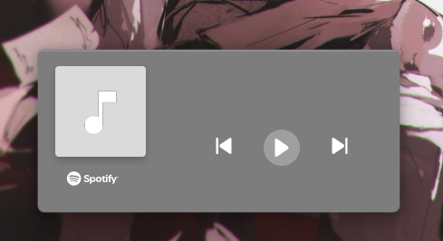

# Spotify Player Widget

This is a simple Spotify player widget built with Electron. It displays current track information, allows the user to control their Spotify playback and the colors of the UI change based on the album colors of the currently playing song using the `color-thief` library.

### Features

- Allows the connection of a Spotify account to control playback (authentication required).
- Display current track information.
- Controls Spotify playback (play, pause, next, previous).
- Includes a progress bar to track the playback progress of the song.
- Displays selected colors from the album art of the currently playing song.

### Screenshots

Here are some screenshots of the widget




### Setup

1. Clone the repository

   ```

   git clone https://github.com/crystalduran/electron-now-playing-widget.git)
   cd electron-now-playing-widget

   ```

2. Install dependencies

   ```

   npm install

   ```

3. Set up your Spotify Developer app

   - Go to the Spotify Developer Dashboard
   - Create a new app if you don't have one already
   - Copy your `CLIENT_ID` from the app settings
   - In the "Redirect URIs" section, add the following URI:

     ```

     spotify-desktop-controller://callback

     ```

4. Set up environment variable for the `CLIENT_ID`

   - Create a `.env` file in the project root
   - Add your `CLIENT_ID` to the `.env` file like so:

     ```

     CLIENT_ID=your-spotify-client-id

     ```

     Or you can just directly replace `process.env.CLIENT_ID` with your `CLIENT_ID` in the code.

5. Run the app with

   ```

   npm start

   ```

### Notes

- The widget is a simple proof-of-concept and is not optimized for production use.
- The app uses the Spotify Web API and requires authorization for accessing playback data.
- The REDIRECT_URI in the app is set to spotify-desktop-controller://callback. Make sure it's configured in your Spotify Developer Dashboard as well.
